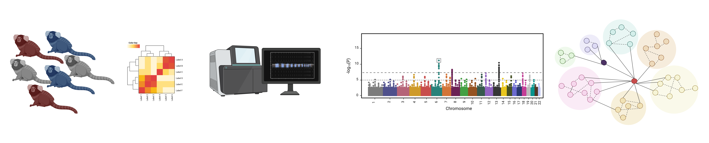

I am studying the basis and progression of neurodegeneration associated with Alzheimer’s disease (AD) in a non-human primate model, the common marmoset. It has been observed that a proportion of animals spontaneously develop AD-like pathology as they age, but the genetic basis for said pathophysiology has not been previously investigated. 

Utilizing a data-driven approach spanning multi-omics, neuroimaging, and clinical biomarkers, my research seeks to infer the genetic factors influencing clinical decline as a function of aging in addition to studying the relationship between candidate AD biomarkers. This is done with clinical biomarkers measured in plasma ($\beta$-amyloid peptides, NfL, GFAP, total Tau), as well as gene and protein expression. I am also studying how these biomarkers change as a function of age.

The objective is to expand our understanding of the genetics underlying this pathology to map real-time changes in gene networks with longitudinally measured phenotypes, potentially uncovering temporal drivers of AD. 