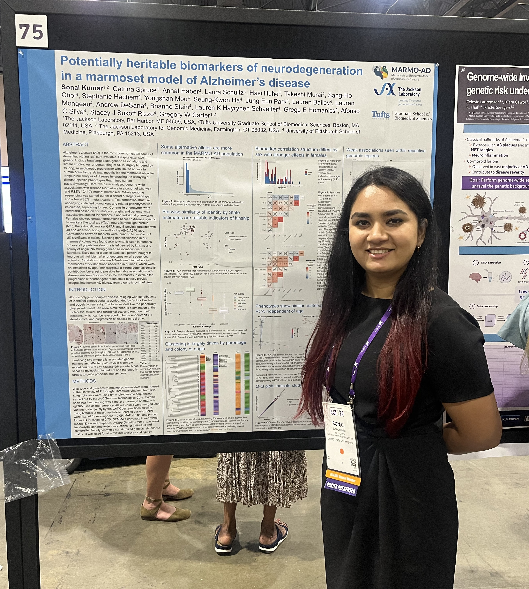

### 2026

-   I presented a poster at Maine's Society for Neuroscience (SfN) chapter organized at JAX.

-   I attended the Maine IDeA Data Science Conference organized at MDI Biological Laboratory this year, and heard current opinions on how AI is reshaping education and science in today's world.

-   I taught a hands-on workshop on Intro to GitHub this January to a group of undergraduate students through the Biomedical Data Science in Context (BDSiC) course at JAX.

### 2025

-   I got the opportunity to present posters showing the latest results from my GWAS project at the Alzheimer's disease GRC in June, at AAIC (virtually) in July, the Simian Collective in August, and the JAX Joint Symposium in October!

-   I served as a TA for the Intro to R courses offered by JAX Data Science Training this fall.

-   I was elected to the JAX Graduate Student Organization, where I serve as the Tufts Co-chair. I will also serve as the JAX representative on the Tufts Graduate Student Council for this academic year.

-   Starting this Fall, I will serve as President for the Tufts Computational Biology Club!

-   I attended the MARMO-AD Consortium Retreat in Pittsburgh, PA, this summer! It was amazing meeting everyone in person.

-   I am mentoring Adon Roy, an undergraduate student at the William Paterson University, through the JAX Summer Student Program (SSP 2025), where he'll be looking at haplotype structure in marmoset genomes.

-   I got certified as a Data Carpentries Instructor this year as a part of the JAX Data Science Fellowship! 

-   I won a JAX Predoc Travel Award! This will fund my attendance and presentation at the Alzheimer's disease GRC in Ventura, CA in June.

-   My abstract originally submitted to the **IEEE Women in Bioinformatics (WIBI) 2025** Workshop to be held on February 6-7, 2024, in New Haven, CT, USA for a poster presentation was scored highly and was accepted as an oral presentation instead!

-   I was nominated to be spotlighted for a student feature by my school! Read about my experience in the program [here](https://gsbs.tufts.edu/news-events/news/sonal-kumar-phd-candidate-neuroscience-jackson-laboratory).

-   I got selected as a JAX Data Science Fellow for the year 2025! 

### 2024

-   I now serve as **Vice President** for the **Tufts Computational Biology Group**. In this role, I will help organize workshops and special sessions, invite external speakers, and help peers with coding challenges.

-   I presented preliminary findings in the first ever poster from my PhD research at the **Alzheimer's Association International Conference** (AAIC) held in July, **2024**, in Philadelphia, PA, USA.

    

-   I have successfully passed my Qualifying Examination and am now officially a PhD Candidate!

### 2023

-   I attended the Marmoset Bioscience Symposium to hear more from researchers in the field! This was held on November 9, 2023, in Washington DC, USA.

-   For distinguished academic performance during my master's degree, I received the **Prime Minister's Scholarship for Best Female Student** for the class of 2022, and was awarded 25,000 rupees.

-   After completing my rotations in the [Carter](https://www.jax.org/research-and-faculty/research-labs/the-carter-lab), [Pera](https://www.jax.org/research-and-faculty/research-labs/the-pera-lab), and [Joy](https://www.jax.org/research-and-faculty/research-labs/the-joy-lab) labs, I've decided to join the **Carter lab**, where I will utilize computational approaches to investigate Alzheimer's disease pathology using the common marmoset as a model system by integrating multiomics data.

### 2022

-   I have graduated with my MSc in Biotechnology and Bioinformatics from [IBAB](ibab.ac.in)! Next, I am moving to [the Jackson Laboratory](jax.org) to begin my PhD in Neuroscience through Tufts University!

-   My master's thesis research officially ends with the Graduate Research Symposium showcasing the research done by the class of 2022!
